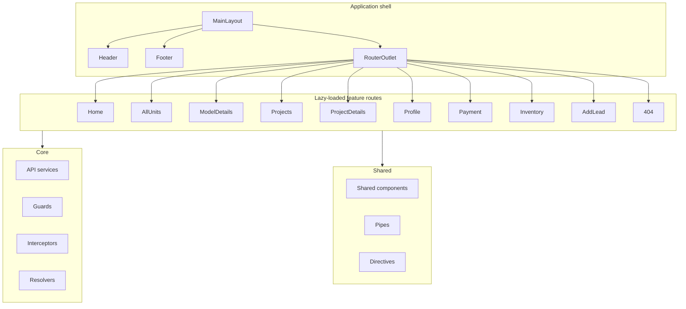

# Architecture and tech stack

This document describes the high-level architecture, tech stack, and bootstrap of the loveResale Sales Frontend.

## Tech stack

| Category | Technology |
|----------|------------|
| Framework | Angular 21 |
| UI library | PrimeNG 21 |
| i18n | Transloco (@jsverse/transloco) |
| State | NgRx Signals, RxJS |
| Rendering | Server-Side Rendering (SSR) |
| Real-time | Socket.io client |
| Video/meetings | Zoom Meeting SDK |
| Carousels | Swiper |
| Icons | angular-svg-icon, PrimeIcons |
| Phone validation | google-libphonenumber |
| Styling | SCSS, CSS variables, PrimeNG theme |

## High-level architecture

- **Layout**: `MainLayout` wraps the app; it contains the header, footer, and a `<router-outlet>` for child routes.
- **Features**: All feature routes are lazy-loaded (either `loadComponent` or `loadChildren`) and render inside the outlet.
- **Core**: App-wide APIs, guards, interceptors, and resolvers. No UI; stateless services and functional guards/resolvers.
- **Shared**: Reusable UI components, pipes, and directives consumed by features and layout.

## Application bootstrap

Bootstrap is defined in [src/app/app.config.ts](../src/app/app.config.ts):

- **HTTP**: `provideHttpClient(withFetch(), withInterceptors(interceptors))` — fetch backend, plus custom interceptors (error handling, cookies for SSR, response messages).
- **Change detection**: `provideZonelessChangeDetection()`.
- **Router**: `provideRouter(routes, withComponentInputBinding(), withInMemoryScrolling({ scrollPositionRestoration: 'enabled' }))`.
- **Transloco**: `provideTransloco` with `TranslocoHttpLoader`; available langs from `core/constants/app`.
- **PrimeNG**: `providePrimeNG(AppTheme)` — theme from [src/app/theme.ts](../src/app/theme.ts).
- **Icons**: `provideAngularSvgIcon()`; `IconLoaderService` loads icons in an app initializer.
- **App initializer**: `AppInitializeService.initialize()` runs on startup.
- **Hydration**: `provideClientHydration(withEventReplay())` for SSR.

Root routes are in [src/app/app.routes.ts](../src/app/app.routes.ts): a single path `''` with `MainLayout` and children from `layout/main-layout.route.ts`.

## Path aliases

From [tsconfig.json](../tsconfig.json), the following path aliases are configured:

| Alias | Resolves to |
|-------|--------------|
| `core/*` | `src/app/core/*` |
| `features/*` | `src/app/features/*` |
| `layout/*` | `src/app/layout/*` |
| `shared/*` | `src/app/shared/*` |

Use these in imports (e.g. `import { authGuard } from 'core/guards';`) instead of relative paths when crossing layer boundaries.

## Global styling

- **Global SCSS**: Under `src/styles/`. Entry is typically `src/styles.scss` (or as configured in `angular.json`). The styles folder uses `_index.scss` to forward: `base`, `components`, `abstracts`, `vendor`.
- **Design tokens**: Colors, font sizes, and spacing should be defined as CSS variables in the global variables sheet under `styles/` and consumed in components via `var(--token-name)`.
- **PrimeNG theme**: [src/app/theme.ts](../src/app/theme.ts) defines the PrimeNG v21 theme (preset, semantic colors, component overrides). Component SCSS should not redefine PrimeNG global styles.

## i18n

- **Library**: Transloco.
- **Translation files**: Loaded from `/i18n/{lang}.json` (e.g. `public/i18n/en.json`). The loader is `TranslocoHttpLoader` in `core/injections/transloco-loader.ts`, which fetches via HTTP.
- **Languages**: English (en) and Arabic (ar). Arabic is RTL; layouts and components should support RTL (e.g. logical CSS properties, direction-aware layout).
- **Usage**: Use the `TranslocoPipe` or `TranslocoService.translate()` for all user-facing text; keys should be namespaced (e.g. `home.title`, `auth.login.button`).

## Related documentation

- [Routing](routing.md) — Route map, lazy loading, guards, resolvers.
- [Core](core.md) — API modules, interceptors, injections.
- [Developer guide](developer-guide.md) — Conventions, styling, adding features.
